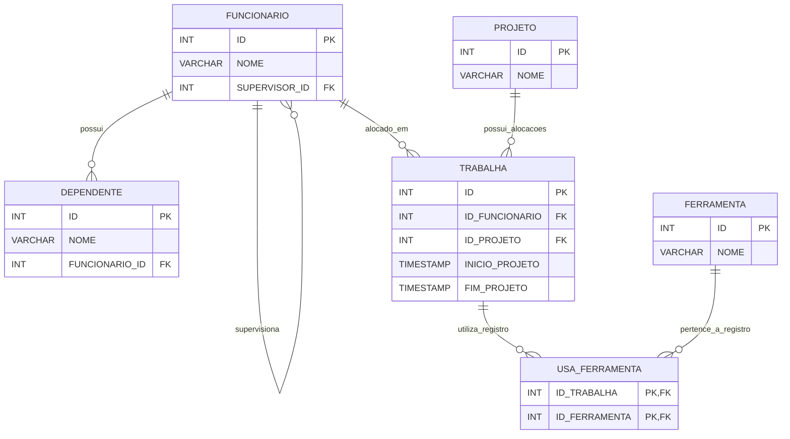

# projeto-bd-agregacao.
TRABALHO DE INTRODUÇÃO A BANCO DE DADOS - AGREGAÇÃO

```mermaid
erDiagram
    %% Relacionamentos
    FUNCIONARIO ||--o{ FUNCIONARIO : "supervisiona"
    FUNCIONARIO ||--o{ DEPENDENTE : "possui"
    FUNCIONARIO ||--o{ TRABALHA : "alocado_em"
    PROJETO ||--o{ TRABALHA : "possui_alocacoes"
    TRABALHA ||--o{ USA_FERRAMENTA : "utiliza_registro"
    FERRAMENTA ||--o{ USA_FERRAMENTA : "pertence_a_registro"

    %% Entidades e Atributos
    FUNCIONARIO {
        INT ID PK
        VARCHAR NOME
        INT SUPERVISOR_ID FK
    }

    DEPENDENTE {
        INT ID PK
        VARCHAR NOME
        INT FUNCIONARIO_ID FK
    }

    PROJETO {
        INT ID PK
        VARCHAR NOME
    }

    TRABALHA {
        INT ID PK
        INT ID_FUNCIONARIO FK
        INT ID_PROJETO FK
        TIMESTAMP INICIO_PROJETO
        TIMESTAMP FIM_PROJETO
    }

    FERRAMENTA {
        INT ID PK
        VARCHAR NOME
    }

    USA_FERRAMENTA {
        INT ID_TRABALHA PK,FK
        INT ID_FERRAMENTA PK,FK
    }
```
